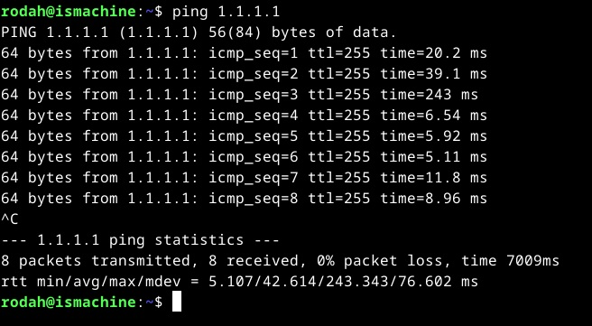
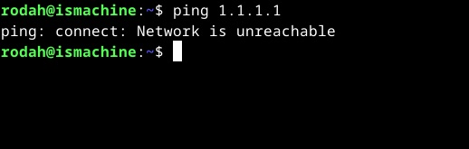
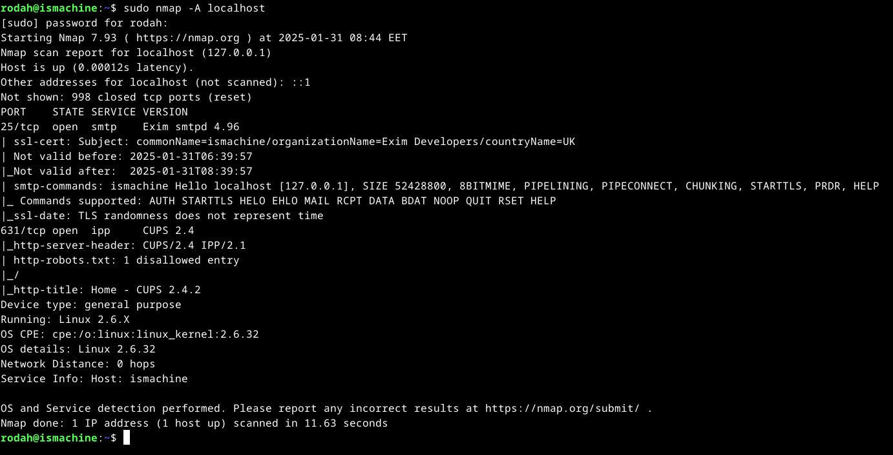
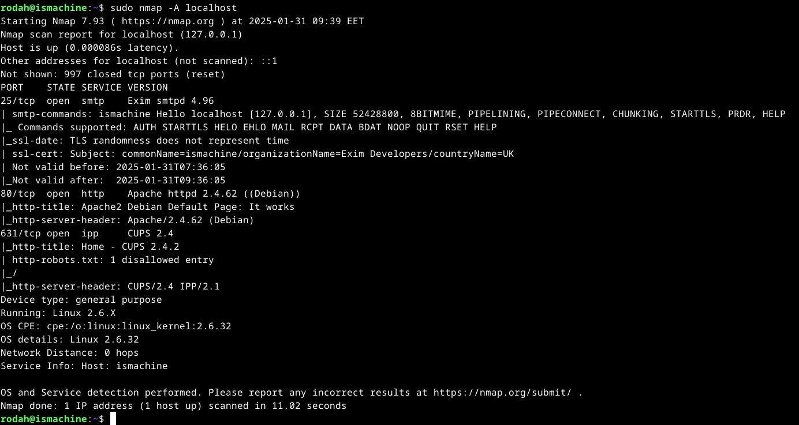

# H3 Homework

## X) Summaries

### <ins>Installing Debian on Virtualbox</ins>      

- Choosing the correct ISO image version ensures compatibility with the underlying system / physical hardware. Live version allows to boot Debian/Linux and test its compatibility with your system before installation. 
-	Virtualbox is virtualization software that’s used to create and manage VMs – environments where  guest OS can be installed and run (Virtualbox.org, 2019). 
-	For the VM, choosing a sufficient amount of RAM translates to better performance, though the RAM on the physical machine sets the upper limit. Storage/VHD, if dynamically allocated, uses only the disk space needed (vs. pre-allocating space). This saves space on the host system, even if a larger number of GBs are allocated for the VM. The ISO image is inserted as the virtual cdrom, from which to boot the VM.  
-	Booting to live version allows to test (e.g. network, display, hardware) the Linux/Debian before installation. 
-	When installing new OS on a real (non-virtual) computer with other pre-existing OS, backups (before installation) should be made to avoid data loss resulting from e.g., reformatting the disk, partition or setting overrides etc. The backups allow restoring the system, files and configurations in case of installation mistakes or failure. 
-	When installing the Linux/Debian on the VM (which is empty), partitioning erases existing data on the disk for clean OS installation. Encryption isn’t necessary because the virtual environment is isolated, can be easily reset/recreated and it usually doesn’t store long-term data. Since the host system should be encrypted, the virtual machine, which is a file on the host system, should be also protected as a result. With the user account creation step, security hygiene guidelines should be followed to create a strong password. The account will have sudo (admin) privileges on the VM.
-	After installation, updating and upgrading packages to the latest versions should be done for e.g. ensuring the compatibility of software components and security patches to fix vulnerabilities. A firewall should also be installed for network security.
-	Similar to backups, taking snapshots of the VM at different points, allow quick restoration of the previous state in case something goes wrong with the current state.  
 
Questions / Insights:  
- How do security measures differ on VM vs. real computers?
- How to safely install Linux on a real computer with other pre-existing OS?

<ins>**References**</ins> 
-	Karvinen 2021: Install Debian on Virtualbox - Updated 2024 at https://terokarvinen.com/2021/install-debian-on-virtualbox/
-	Karvinen 2025 - Information security at https://terokarvinen.com/information-security/
-	Virtualbox.org 2019 - Oracle VM VirtualBox at https://www.virtualbox.org/manual/ 

### <ins>Command Line Basics Revisited</ins>     

The command line in Linux is useful for convenience, fast execution and automation.

Directory structure
- Linux’s directory structure is organized into a tree-like hierarchy, where the root directory `/`is at the top of the filesystem. All other directories and files branch out from the root, so everything is under  `/`.
- Key directories, such as `/home` (user directories), `/etc` (system settings). `/var`(system logs) are sub-directories under the root.
- A home directory `/home/<user>/`is the default login directory of a user and the location where the user can store their files or make settings (unless their privileges are temporarily elevated with `sudo`). The working directory is the current directory location of the user withing the tree.  

Privileges (access control)
- Principle of least privilege should always be followed. Using `sudo` for elevated privileges (temp) should only be used if necessary. 
- Sudo privileges are required for commands affecting the whole system (installations, privilege management, user management etc.)

Help with commands
- `man <command>` display man -pages for information about the command and its options & parameters/arguments
-	`-h` or `--help` brief built-in help for commands
-	`tab` autofill a command or display a list of possible commands (based on what’s written on the prompt)

Commands for navigation and viewing contents:
-	`pwd` display working directory
-	`cd` navigate / move around the directory tree
-	`ls` list contents of current directory, `less` view contents of a text file
-	`| less` control output with piping 

Commands for create, rename, copy or delete files / directories
-	Files can be created with text editors such as `nano` or `pico`
-	Files can have any suffix, and they don’t need to be given a suffix as Linux determines the file type based on its content. 
-	`mkdir` create a new directory
-	`mv` move or rename file / directory
-	`cp` copy  file or directory
-	`rm` remove file
-	`rmdir` remove empty directory, `rmdir -r` remove directory and its contents recursively

Commands for remote control
- `ssh` establish secure connection
- `scp`or `sftp` securely copy files or dirs between local and remote machine

Commands for package management & installations
-	Package management tools: `apt-get` high-level management, `dpkg` low-level management (GeeksforGeeks, 2022).
-	`sudo apt-get <update or upgrade>` update package list or upgrade existing packages to latest versions
-	`sudo apt-get install` install a software/package
-	`apt-cache search` search for a package with keyword
-	`sudo apt-get purge` remove a package & its settings

Questions / Insights:  
- Why has the command line remained relevant and unchanged for so long?
- Could you automate linux security with scripts?

<ins>**References**</ins> 
-	Karvinen 2020: Command Line Basics Revisited at https://terokarvinen.com/2020/command-line-basics-revisited/#comments
-	Karvinen 2021: Install Debian on Virtualbox - Updated 2024 at https://terokarvinen.com/2021/install-debian-on-virtualbox/
-	GeeksforGeeks. (2022) - Difference Between APT and DPKG in Ubuntu at https://www.geeksforgeeks.org/difference-between-apt-and-dpkg-in-ubuntu/ 

## A) Can't fish

- The ping command is commonly used for testing network connectivity. It uses ICMP to send packets to a specified IP address (`ping <ip-address>`), and the received output is used for troubleshooting potential connection issues (Globalping, 2023).
- Before disabling the network, connectivity was tested with pinging Cloudflare’s DNS server (1.1.1.1).  The test was successful.
- Output for successful test - network connection on(Globalping, 2023):
  
   - First line: Destination IP address & size of sent packets
   - Ping responses received from the target:
   - 64 bytes - confirms that a 64-byte packet was received as a response from the target
   - icmp_seq – a sequence number of a packet and a counter that increases with each packet sent. Used for tracking packet order or packet loss
   - ttl (time-to-live)  - the number of hops (routers) the packet traveled through to reach the destination.
   - time – the round-trip time (RTT) describes the duration it took for the packet to travel from to the destination and back
     
- Ping statistics summary at the end indicates the percentage of packets lost and min/avg/max/mean deviation values for the RTT. The values indicate the speed and stability of the network connection and potential issues.

- Afterwards, the network was disabled from settings (machine -> settings -> network -> uncheck  “enable network adapter”). The machine had to be shut off for making the change.
- Output for unsuccessful network test (network connection off):
  
   - Network is unreachable, which shows that the ping query was unable to be sent to the destination. (E.g., timeout message would indicate that packets were sent but no response was received (Garn, 2021))

<ins>**References**</ins> 

- Globalping (2023). How to Read Ping Results: A Beginner’s Guide. [online] Globalping Blog. Available at: https://blog.globalping.io/how-to-read-ping-results-a-beginners-guide/ 
- Garn, D. (2021). Ping command basics for testing and troubleshooting. [online] Available at: https://www.redhat.com/en/blog/ping-usage-basics.
- Karvinen 2025 - Information security at https://terokarvinen.com/information-security/ 

## B) Local only - Port scanning

-	Nmap (network mapper) is an open-source Linux command line tool for network discovery and security auditing. The tool uses IP packets to provide real time information of a network: hosts available on a network, services offered by the host (applications and versions), host OSs, types of firewalls or packet filters in use and number of ports among other characteristics. Nmap can be used e.g. to identify network vulnerabilities (Dancuk, 2024; GeeksforGeeks, 2020; Marijan, 2024)
-	The nmap utility was installed with the command `sudo apt install nmap -y. To check the version and that the installation was successful `nmap –version` (version 7.93 was installed) (Marijan, 2024).
-	After disconnecting from the network, the local computer (localhost) was port scanned with the command: `sudo nmap -A localhost`. The command port scans 1000 most common TCP ports. The `-A` option enables comprehensive scan features, such as  OS detection, version detection, script scanning, and traceroute (Marijan, 2024).
  
-	The output:
  
   - First three lines show the nmap version, confirm that the machine scanned was localhost, and that the machine is online. 
   - Closed: “Not shown:996 closed ports” indicates that out of the 1000 ports scanned, 996 are closed. Closed in this context means that the ports are accessible, but no application is listening on the port (Marijan, 2024)..
   - Open ports (Actively accepting TCP connections, UDP datagrams, or SCTP associations) ,3] ((Marijan, 2024): 
      - `25/tcp  open  smtp  Exim smtpd 4.96` – The service running on port 25 is SMTP (Simple Mail Transfer Protocol), which is used for sending and receiving emails. The mail server software used is Exim (version 4.96) (Wikipedia, 2024).
      - `631/tcp open  ipp  CUPS 2.4` - The service running on port 631 is CUPS, which is used for printer management and network printing using the IPP (internet printing protocol) (Wikipedia, 2020).
      - Last lines provide information about the machine and the OS. 

<ins>**References**</ins>   
- Karvinen 2025 - Information security at https://terokarvinen.com/information-security/
- GeeksforGeeks. (2020). Nmap Command in Linux with Examples. Available at: https://www.geeksforgeeks.org/nmap-command-in-linux-with-examples/.
- Marijan, B. (2024). How to Install & Use NMAP Security Scanner on Linux. Knowledge Base by phoenixNAP. Available at: https://phoenixnap.com/kb/how-to-install-use-nmap-scanning-linux.
- Dancuk, M. (2024). How to Use Nmap to Scan for Open Ports {Updated Tutorial 2019}. Knowledge Base by phoenixNAP. Available at: https://phoenixnap.com/kb/nmap-scan-open-ports.
- Wikipedia (2024). Exim. Available at: https://en.wikipedia.org/wiki/Exim
- Wikipedia. (2020). CUPS. Available at: https://en.wikipedia.org/wiki/CUPS

## C) Daemon scan

-	First, the package list was updated for latest versions with `sudo apt-get update`
-	Next the Apache2 web server was installed with `sudo apt-get -y install apache2`
-	To start the daemon/Apache web server: `sudo systemctl start apache2`, to check that the status of the process: `sudo systemctl status apache2` (Sharma, 2024)‌. Output was active (running), which means that it is working.
-	Next network was again, before running the nmap scan again: `sudo nmap -A localhost`
  
-	Output:
  
   - The output seems almost identical to our previous scan. The only difference is that now port 80 is also open with Apache HTTP web server (ver 2.5.62) running on a Debian system: `80/tcp  open  http   Apache httpd 2.4.62 ((Debian))`. Port 80 is for HTTP (Dancuk, 2024).

<ins>**References**</ins> 
-	Karvinen 2025 - Information security at https://terokarvinen.com/information-security/
- Dancuk, M. (2024). How to Use Nmap to Scan for Open Ports {Updated Tutorial 2019}. Knowledge Base by phoenixNAP. Available at: https://phoenixnap.com/kb/nmap-scan-open-ports.
- Sharma, S (2024). Use Systemctl Status Command to Check Service Status. [online] Available at: https://linuxhandbook.com/systemctl-check-service-status/.

## D) ....
<ins>**References**</ins> 
