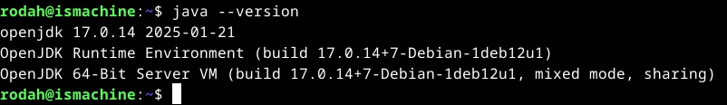
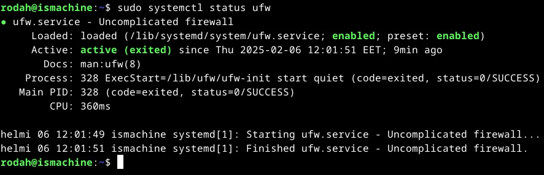
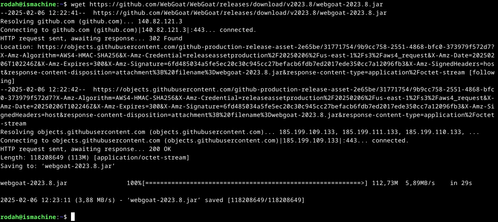
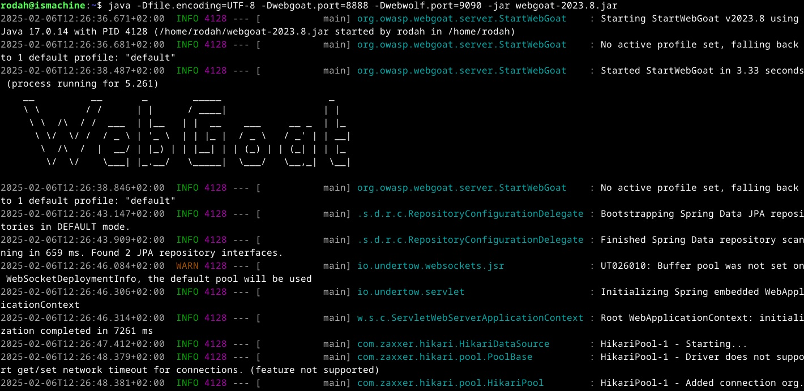
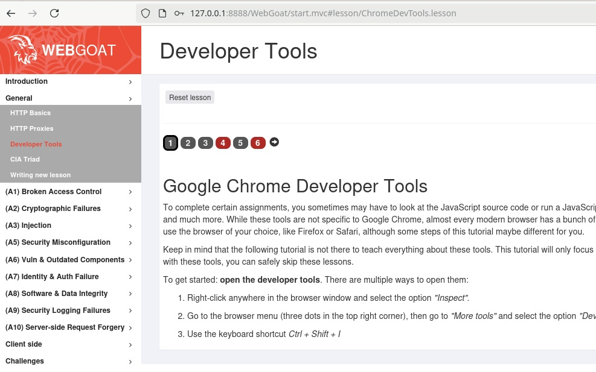

# H4 Homework

## X) Summaries

### <ins>OWASP 10 (2021)</ins>  

<ins>A01:2021 - Broken Access Control</ins> 

- Broken/ faulty access control is ranked 1st in the 2021 list of top 10 web application security risk. It’s a major security risk found in 94% of evaluated web applications.
- Broken access control refers situations where users gain access data and/or can perform actions beyond their intended permissions. Access control should be enforced to restrict user actions to their permitted access levels.
   
- Some common vulnerabilities:
  - Principle of least privilege or deny by default -rule is not enforced. Users indiscriminately gain access to more capabilities than needed. 
  - Escalating privileges by tampering with tokens (e.g. JWTs, access control tokens), cookies or hidden fields to access functions meant for high-level users, such as admins.
  - Bypassing restrictions/control checks by modifying either URLs, API requests or the application’s internal state.
  - CORS (Cross-Origin Resource Sharing) misconfiguration. Allows access from unauthorized or untrusted origins/domains.
    
- Prevention:
  - Implement access control methods on the server-side (or server-less API). Unlike on the client-side, attackers cannot interfere with access control checks or metadata there.
  - Deny access by default
  - Centralize access control and apply it consistently throughout the application
  - Monitor, log and limit access attempts. Alert admins for suspicious patterns, such as repeated failures.
  - Invalidate session tokens after logout.

<ins>A05:2021 - Security Misconfiguration</ins>  

- Security misconfiguration is ranked 5th in the 2021 OWASP 10. It’s a major web application security risk found in 90% of evaluated web applications.
- Refers to situations where an application is made vulnerable due to e.g., lack of proper security hardening (reducing the attack surface across the system/ application stack), including unnecessary features (e.g. ports, services, accounts, privileges), improper error log handling, or having out of date software/ security features.
  
- Prevention:
  - Implement a minimal platform without any unnecessary features, components,
  - Implement a patch management process. Periodically review and update configurations, security patches, and cloud permissions (e.g. for storage).
  - Segment application architecture for clear separation/ boundaries between its components. 
  - Automate the security configuration verification and hardening processes across different environments (development, QA, production).

<ins>A06:2021 - Vulnerable and Outdated Components</ins>  

- Vulnerable and outdated components are a major web application security risk ranked 6th in the 2021 OWASP 10.
  
- Some common vulnerabilities:
  - Failure to regularly track and update software components or check for vulnerabilities. Unawareness of component versions in use.
  - Software components used are vulnerable, unsupported or outdated. Components include e.g., OS, DBMS, server, application, APIs, runtime environments, frameworks, dependencies and libraries.
  - Untested compatibility of updates with other components before implementing them with the existing system.
    
- Prevention:
  - Implement an automated, ongoing patch management process for continuous tracking, inventory and updates to ensure regular/timely patches and upgrades.  
  - Components used should be obtained securely from official sources. Unused or unnecessary dependencies, features or components should be discarded.

<ins>A03:2021 – Injection</ins>  

- Injection is ranked 3rd in the 2021 OWASP 10. It’s a major web application security risk found in 94% of evaluated web applications.
- Refers to situations where users/attackers gain access to data by inserting their own command or query into an input that lacks proper validation. 
- Common injections include: SQL, NoSQL, OS commands, ORM (object relational mapping), LDAP, EL (expression language) or OGNL (object graph navigation library)

- Some common vulnerabilities:  
  - User input is not validated, filtered or sanitized
  - The application builds dynamic queries/commands by concatenating user input or doesn’t escape special characters in the queries. 
  - Hostile data is used directly in queries, commands or within ORM search parameters
    
- Prevention:  
  - Data should be kept separate from commands and queries
  - Safe APIs that do not rely on direct interpreter execution should be used
  - Validate, filter and sanitize user input on the server side.
  - Escape special characters if dynamic queries are in use
  - Use SQL controls to prevent mass disclosure of data in the event of SQL injection attacks

<ins>Own thoughts, ideas or questions</ins>  

- Why is negligence on access control on the rise (rank 1) while broken authentication has fallen from rank 2 to rank 7?
- How to effectively automate security configurations throughout the app’s lifecycle and across development, QA and production environments?
- How to ensure comprehensive security if/when updates are incompatible with some of the application’s components?
- How do all of the injection methods differ from each other? Are some of them more effective or harmful than others?

<ins>References</ins> 
- A01:2021 - Broken Access Control at https://owasp.org/Top10/A01_2021-Broken_Access_Control/ 
- A05:2021 - Security Misconfiguration at https://owasp.org/Top10/A05_2021-Security_Misconfiguration/ 
- A06:2021 - Vulnerable and Outdated Components at https://owasp.org/Top10/A06_2021-Vulnerable_and_Outdated_Components/ 
- A03:2021 – Injection at https://owasp.org/Top10/A03_2021-Injection/ 

### <ins>Web comic: Exploits of a mom</ins>  

- Description
  - The web comic describes a situation where a user input is structured as a SQL injection/ malicious SQL command (`Robert '); DROP TABLE Students; --”`). The software system in question didn’t properly handle (escape) special characters in the input, which lead to major data loss. 

- Lesson:
  - Sanitize and validate user inputs to prevent SQL injection vulnerabilities

- ### <ins>References</ins>  
  - Munroe: xkcd 327: Exploits of a Mom at https://xkcd.com/327/ 

## A) Goat. Install WebGoat 2023.4
<ins>Install Java</ins>  
- `sudo apt-get update`
- `sudo apt-get install openjdk-17-jre`
- `java –version` (Verify installation)
  

<ins>Install & enable Firewall (already done previously)</ins> 
- `sudo apt-get -y install ufw`  
-`sudo ufw enable`  
-`sudo systemctl status ufw` (Verify installation)   
  

<ins>Donwload WebGoat JAR</ins>   
- Install wget first:  
   -`sudo apt-get update && sudo apt-get install wget -y`  
   -`wget –version`  (GNU Wget 1.21.3) Verify installation   
- Note, port change did  not work with the lates version, so the version shown in the course materials was used instead  
   -` wget https://github.com/WebGoat/WebGoat/releases/download/v2023.4/webgoat-2023.4.jar` (Ver  2023.4)   
   -(`wget https://github.com/WebGoat/WebGoat/releases/download/v2023.8/webgoat-2023.8.jar`) https://github.com/WebGoat/WebGoat/releases)
    

<ins>Run WebGoat on another port (change ports)</ins>   
- `java -Dfile.encoding=UTF-8 -Dwebgoat.port=8888 -Dwebwolf.port=9090 -jar webgoat-2023.4.jar`  
(-`java -Dfile.encoding=UTF-8 -Dwebgoat.port=8888 -Dwebwolf.port=9090 -jar webgoat-2023.8.jar`)  
 Newest version port change did not work and still ran on port 8080 instead.  
   

- Navigate to URL: http://127.0.0.1:8888/WebGoat       
- Once the login page is accessed at URL http://127.0.0.1:8888/WebGoat, register with a username and password of your own (admin password are printed on terminal output)  
 

### <ins>References</ins>  
- Karvinen 2021: Install Debian on Virtualbox - Try Web Hacking on New Webgoat 2023.4 at https://terokarvinen.com/2023/webgoat-2023-4-ethical-web-hacking/ 

## B) F12. Solve Webgoat 2023.4: General: Developer tools
### <ins>References</ins>  

## C) Not outdated. Update all operating system and all applications in your Linux.
### <ins>References</ins>  

## D) Sequel. Solve SQLZoo
### <ins>References</ins> 

## E) Solve Portswigger Labs: SQL injection vulnerability
### <ins>References</ins>  

