# H5 Homework

## X) Summaries

### <ins>Applied Cryptography: Chapter 1</ins>   

<ins>Basic terminology</ins> 
- Cryptography = The science or practice of securing communication through converting readable data/messages (plaintext) into an unreadable form (ciphertext) and the other way around.
- Cryptoanalysis = The practice of analyzing and breaking ciphertext to reveal the plaintext without the correct key. An attempted cryptoanalysis is referred to as an attack.
- Cryptology = The branch of mathematics studying both cryptography (creating secure communication methods) and cryptoanalysis (breaking the methods). 
- Plaintext (M) = The original readable message to be encrypted. Can be in the form of a txt, audio, video, image files etc.
- Ciphertext (C) = Encrypted, unreadable version of the plaintext
- Encryption = process of converting plaintext into unreadable ciphertext
  - Encryption function: `E(M) = C` or  `EK(M) = C`
- Decryption = Process of converting ciphertext back into readable plaintext
  - Decryption function: `D(C) = M` or `DK(C) = M`
- Cipher / Cryptographic algorithm = Mathematical function used for encryption or decryption. 
- Code = A cryptosystem dealing with linguistic units (words, phrases. Sentences). Useful in specific circumstances, less flexible than ciphers. 
- Key (K) = A value used in encryption and decryption operations. Determines how algorithms process the data. 
- Keyspace = The range of possible values of a key
- Cryptosystem = The algorithm, plus all possible plaintexts, ciphertexts, and keys
- Compromise = The loss of a key through non-cryptanalytic means

<ins>Purpose / Goals of cryptography</ins> 
- Protecting messages/data from unauthorized access and modification by ensuring confidentiality, integrity, authentication and non-repudiation.
  - Confidentiality – Ensuring only authorized people can access data/messages. 
  - Authentication – Verifying the legitimacy of the identity of the sender or receiver.
  - Integrity – Ensuring that data has not been altered or tampered with during transit
  - Nonrepudiation – Preventing the sender from denying the action of sending the message. Digital signature proof & logs
- Designing cryptosystems that are infeasible to break with current or future computing power available

<ins>Algorithms (ciphers)</ins> 
- Modern cryptographic algorithms use keys to encrypt and decrypt messages. 
  - The security in the algorithms is based on the keys rather than the details of the algorithm itself, unlike in older algorithms)
  - A specific key is required for reading the message
  - Some algorithms use different keys for encryption and decryption
- The best algorithms are the ones that have been made public, have been attacked by leading cryptographers for years, and have yet to been broken. Good quality algorithms rely on peer review.

- <ins>Types of key-based algorithms:</ins>
	1. Symmetric algorithms  
		- Encryption methods where the same key is used for both encryption and decryption. Both sender and receiver must agree on a shared key before secure communication is possible. The key must remain a secret between the communication parties.  
		- Subcategories:  
			- Stream ciphers which operate on plaintext one bit/byte at a time
			- Block ciphers operating on the plaintext in groups of bits (e.g. 64 bits). 
	2. Asymmetric / Public-Key algorithms
		- Encryption methods where two different keys are used – public key for encryption and private key for decryption. The public key can be distributed publicly while the corresponding private key should remain a secret.
		- (With digital signatures, though, private keys are used for encryption and public keys for decryption)

- <ins>Computer algorithms:</ins>
  - Symmetric:
  	- DES
  - Asymmetric:
  	- RSA
  	- DSA
 
- <ins>Algorithm security:</ins>
	- If the value gained from breaking an algorithm is less than the cost of breaking it, the less likely it will be targeted
	- Unconditionally secure algorithms remain secure regardless of the amount of resources the attacker has (computational power or information). 
	- Computationally secure algorithms are considered secure as long as the attacker doesn’t have enough resources (computational power, information, time) to break the encryption 

- <ins>Categories of breaking an algorithm (increasing order of severity:</ins>
	- Total break
	- Global deduction
	- Instance/local deduction
	- Information deduction

<ins>Cryptoanalysis</ins> 
- Assumptions:
  - The cryptanalyst has complete knowledge of the cryptographic algorithm and its implementation
  - Strength/secrecy of the cryptosystem resides entirely in the key, not the algorithm
    
- Types of cryptoanalytic attacks:    
	a) Text-based attacks (Primarily target the ciphertext or original plaintext):    
		- Ciphertext-only attack (deduce plaintext or key based on ciphertext)  
		- Known-plaintext attack (deduce key(s) based on cipher- and plaintexts)  
		- Chosen-plaintext attack (deduce key(s) based on specific cipher- and plaintexts)  
		- Adaptive-chosen-plaintext attack (dynamically deduce key(s) based by adapting the chosen cipher- and plaintexts based on previous results)  
		- Chosen-ciphertext attack (deduce key(s) based on chosen cipher- and plaintexts)  
	
	b) Key-based attacks (Primarily utilizes knowledge about relationships between keys):  
		- Chosen-key attack  
	
	c) Other attacks  
		- Rubber-hose cryptanalysis. Involves threats and blackmail for obtaining a key
		- Purchase-key attack. Involves using bribery for obtaining a key

<ins>Classical and  Pre-computer cryptography</ins> 
- Steganography 
	- Practice of concealing secret messages within other non-suspicious messages in a way that keeps its existence unnoticed even if the communication is intercepted.
	- Methods: invisible ink, subtle marks, image pixel alterations
- Character- based ciphers:
  - Differ from modern algorithms in that they work on characters instead of bits. 
  - Most good modern cryptographic algorithms still combine elements of substitution and transposition.
	   a) Substitution ciphers
	  	- Involve replacing each character of the plaintext with another character in the ciphertext
	  	- Types: Simple (e.g. Caesar Cipher), Homophonic, Polygram, Polyalphabetic
	   b) Transposition ciphers
	  	- Involve rearranging the order of characters in a plaintext to create ciphertext
	  	- E.g., columnar transposition
- Mechanical encryption devices
	- Rotor machines which automate encryption by using rotating rotors to perform substitutions (e.g. the Enigma)

<ins>Some encryption – decryption techniques</ins> 
- XOR (Exclusive-or) operation
  - A logical operation that returns true (1) if the two bits are different, and false (0) if the bits are the same
  - Simplistic and easy to break. Considered insecure and a poor cryptographic practice if used alone by itself. 
  - Despite providing poor security, is widely used in cryptography algorithms by software vendors
  - Can be used in OTP to help provide strong security
    
- OTP (One-time pads)
	- An encryption technique where each letter/ bit of a message is encrypted by combining it with a random key. The key is random, can be used only once, and is as long as the message. After encryption, the key is destroyed. Without knowing the key, encryption should be unbreakable since the ciphertext will look entirely random and can correspond to any possible plaintext (every possible plain text should be equally likely)
	- Provides perfect encryption if the key is truly random and used only once/never reused. 
  - Despite some practical challenges, has bene used in low bandwidth, ultra-secure communications/hotline channels

<ins>References</ins> 
- Schneier, B.2015: Applied Cryptography: Chapter 1: Foundations. O’Reilly Online Learning. Available at: https://learning.oreilly.com/library/view/applied-cryptography-protocols/9781119096726/08_chap01.html#chap01-sec001

### <ins>PGP – Send Encrypted and Signed Message</ins>  

- The article demonstrates Asymmetric encryption (using PGP) by simulating two users.

<ins>Basic concepts</ins>   
- Data sent over the internet can be intercepted, modified, or viewed by unauthorized parties. Encryption and signing are used to protect messages sent over untrusted connections. 
- Encryption protects data by converting it into an unreadable format.
- Signing uses digital signatures to protect data from modification and confirms the sender’s identity.

- PGP is a highly secure encryption standard which is used for encrypting and signing messages. 
- GPG (GNU privacy guard) is a tool for using PGP encryption

- Asymmetric/ Public key encryption uses a keypairs - public keys (shared publicly) and private keys (kept private) – to establish trust between senders and recipients. Both parties generate a key pair from which public keys are exchanged. The exchanged keys are used for both message encryption and verification of the sender’s identity (signature). 
- Public key is used for:
  - Encryption
  - Verifying signatures
  - Sending (encrypted) messages (recipient’s public key)
- Private key is used for:
  - Decryption
  - Signing messages

- Key management/protection is important. Losing or leaking the private key compromises security. In such a case, the private key should be disabled in all services using it.  

<ins>Steps for establishing trust in Asymmetric Encryption </ins> 
- Note: related commands are shown in exercise c)

1. Generate key pair (both parties)
2. Exchange public keys (over untrusted channels):
  a) Export your public key and share it to the source from which you want to receive messages
  b) Import the public key of the other party.  
3. Verify that the public key belongs to the appropriate party and sign it as trusted. Keys can be verified with fingerprints, associated email addresses or signatures from trusted third parties.

<ins>Steps for sending messages in Asymmetric Encryption</ins> 
- Note: related commands are shown in exercise c)

1. Generate message
2. Encrypt the message using the recipient’s public key
3. Sign the message using your own private key. (This signature is used by the recipient to verify sender’s identity. The verification on the recipient side uses the sender’s public key which was exchanged in trust establishment).
Note: Only recipient’s private key can decrypt the message after this point (recipient’s matching pub-priv key pair).
Only recipient’s private key can decrypt the message after this point (recipient’s matching pub-priv key pair )
4. Send message to recipient over an untrusted channel.

<ins>Steps for receiving messages in Asymmetric Encryption</ins> 
- Note: related commands are shown in exercise c)

1. Decrypt message private key
2. Verify sender’s signature with sender’s public key (which was exchanged earlier in trust establishment)

<ins>References</ins> 
- Karvinen 2023: PGP - Send Encrypted and Signed Message – gpg at https://terokarvinen.com/2023/pgp-encrypt-sign-verify/

## A) Install OpenSSH server & connect to it using SSH client

<ins>Installation:</ins>   
- `sudo apt-get update`
- `sudo apt-get install ssh`  (installs both open ssh client & sevrer)
- `sudo systemctl start ssh`
- `sudo systemctl status ssh `

<ins>Establish SSH connection:</ins>   
- Syntax for establishing SSH connection to the destination: `ssh user@hostname`
- `whoami` tells the username
- `ssh rodah@localhost` & enter password
- `w` displays currently logged-in users
 
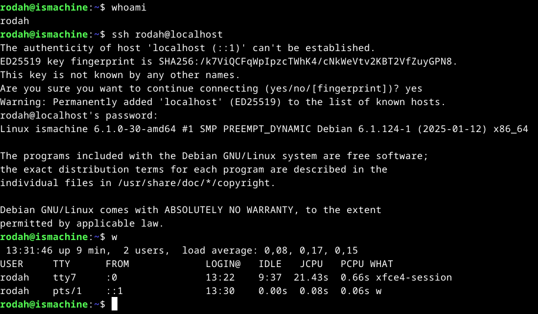

<ins>Terminate SSH connection:</ins>  
- `exit`
  
<ins>References</ins> 
- Karvinen 2025 - Information security at https://terokarvinen.com/information-security/ 
- Kaplarevic, V. (2024). How to Enable SSH on Debian 12. Available at: https://phoenixnap.com/kb/how-to-enable-ssh-on-debian.

## B) Automate SSH connection using public keys

<ins>Generate a key pair:</ins> 
- `ssh-keygen` (proceed w/ defaults, skip passphrase)
  
<ins>Verify that the keypair has been generated:</ins> 
- `ls .ssh`
	- Private/ secret key: `id_rsa`
	- Public key: `id_rsa.pub`  

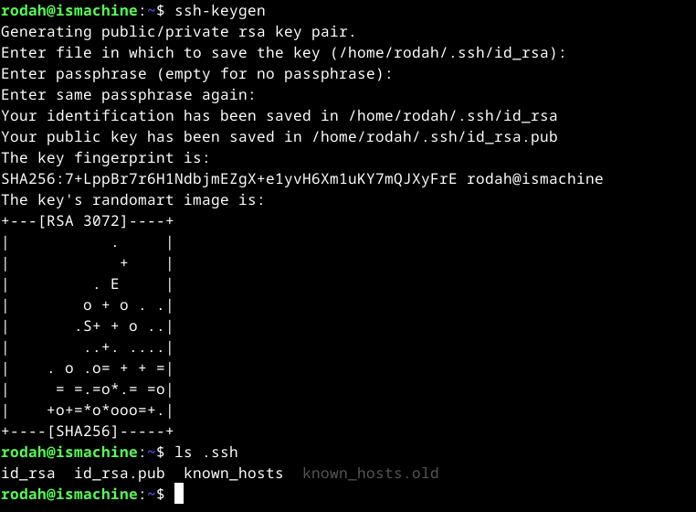

<ins>Copy the public key to the sshd server:</ins> 
- Syntax: `ssh-copy-id user@machine` 
- `ssh-copy-id rodah@localhost`

<ins>Test automated connection:</ins>
- `ssh rodah@localhost ` again, but now without having to provide a password

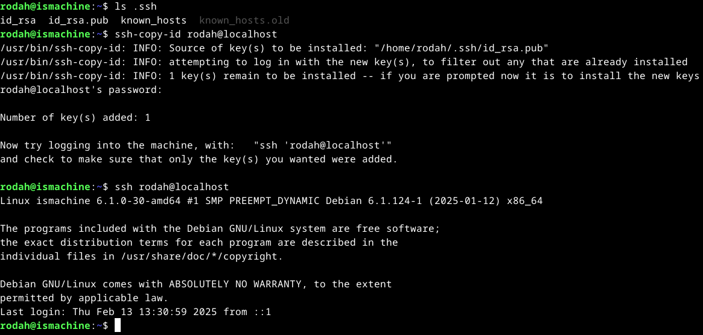
  
<ins>References</ins> 
- Karvinen 2025 - Information security at https://terokarvinen.com/information-security/

## C) Pretty Good indeed. Encrypt and decrypt a message with 'gnupg', using PGP public key cryptography.

<ins>0. Install the 'gpg' encryption tool</ins>  
-`sudo apt-get update`
-`sudo apt-get install gpg micro psmisc` 

<ins>1. Generate a key pair</ins>  
- The key pair will consist of public key and a private/secret key
- For "Main user" (us)
	- `gpg --gen-key`
	- Give real name & email address. Leave password/passphrase as empty when prompted
	- The key pair is saved to the home directory under .gnupg
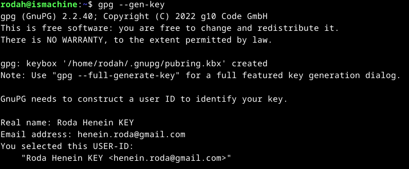
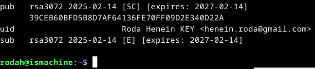   

- Simulate “Another user”:
	- `mkdir another_user/`  (in home directory)
	- `chmod 700 another_user /` or alternatively `chmod og-rwx another_user/ `
	-  `cd another_user`
	- `gpg --homedir . --fingerprint`
	- Every command run in "Another user's" directory should start with `gpg --homedir .`
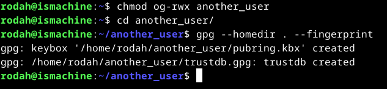   

<ins>2. Export public keys</ins>  
- Export "Main user's" public key 
	- `gpg --export --armor --output roda.pub`
	- Command parameters:
		-    `--export` Export my public key
		-   ` --armor` Use only ASCII characters. Allows the output to be viewed and copy-pasted.
		-    `--output <filename>` Save the output into a specified file
	- Verify that the public key has been generated & display the 4 first lines of the file
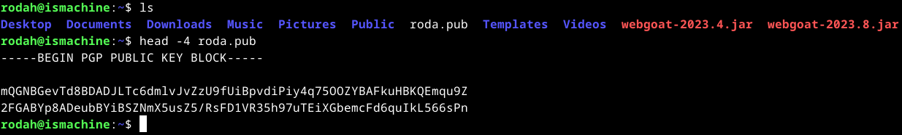

- Export "Another user’s" public key:
	- `gpg --homedir . --gen-key`
	- Repeat the steps (name, email, no passphrase)
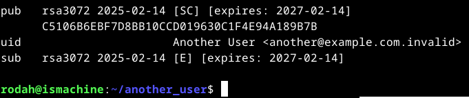   

- `gpg --homedir . --export --armor --output another_user.pub`

<ins>3. Exchange public keys</ins>  

A) Copy “Main user's” public key to “Another user”
	- `cp -v roda.pub another_user/` Simulate file transfer over a network with copy
- Import the public key
	- `gpg --homedir . --import roda.pub`
- Verify with fingerprint that the public key really belongs to “Main user”
	- `gpg --homedir . --fingerprint`
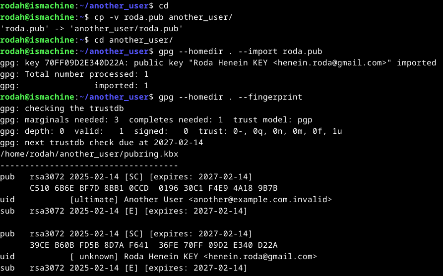    

- Sign the public key as trusted and check the trust
	- `gpg --homedir . --sign-key "39CE B60B FD5B 8D7A F641  36FE 70FF 09D2 E340 D22A"`
	- `gpg --homedir . --fingerprint`
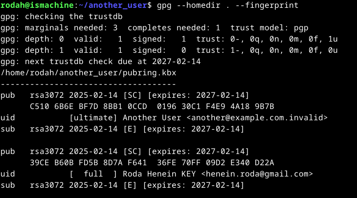    

B) Copy “Another user's” public key to “Main user”
- Copy, import, sign & verify the key
	- `cp -v another_user/another_user.pub .`Simulate file transfer over a network  (in the home directory)
	- `gpg --import another_user.pub`
	- `gpg --sign-key "C510 6B6E BF7D 8BB1 0CCD  0196 30C1 F4E9 4A18 9B7B"`
	- `gpg --fingerprint`
   
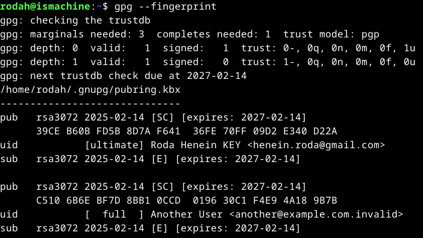    

<ins>4. Encrypt & send a message</ins>  

- “Another user” is the sender in the scenario
	- `cd ~/another_user/`
- Create message (with content)
	- `nano message.txt`
- Encrypt & sign the message with private key
	- `gpg --homedir . --encrypt --recipient henein.roda@gmail.com --sign --output encrypted.pgp --armor message.txt`
	- Command parameters:
		- `--encrypt` Encrypt the message
		- ` --recipient tero@example.com.invalid` To key identified by email address. Alternatively, fingerprints can be used
		- ` --sign ` Sign the message using private key (“Another user’s”)
		- `--armor ` Use printable ASCII characters for the message.
		- `--output <filename>` Save the encrypted message to the specified file
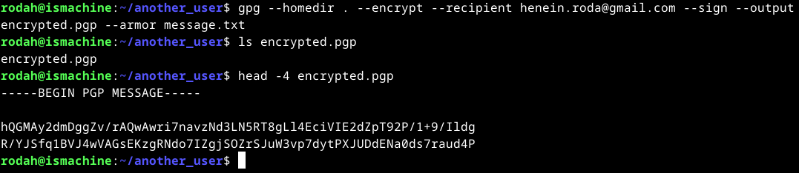    

<ins>5. Receive, Decrypt and Verify the message</ins>  

- "Main user” is the receiver in this scenario
- Simulate network communications/file transfer with copying the file:
	- `cp -v another_user/encrypted.pgp .`
- Decrypt the message:
	- `gpg --decrypt encrypted.pgp`  
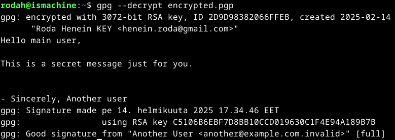    

<ins>References</ins> 
- Karvinen 2023: PGP - Send Encrypted and Signed Message – gpg at https://terokarvinen.com/2023/pgp-encrypt-sign-verify/

## D) Password manager, open and cloudless

- TBA
- Bitwarden vs. KeyPass/KeePassXC -> check these ones out

<ins>References</ins> 
- 
