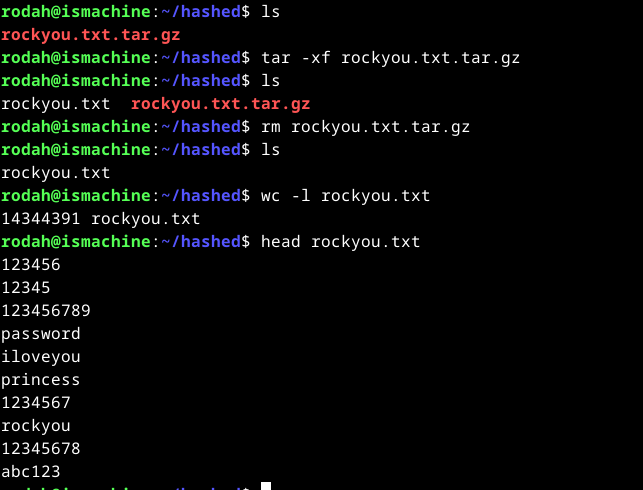
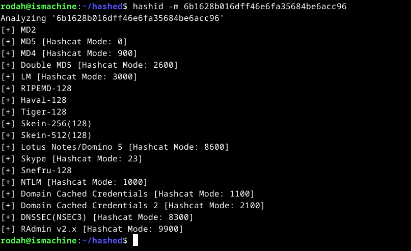
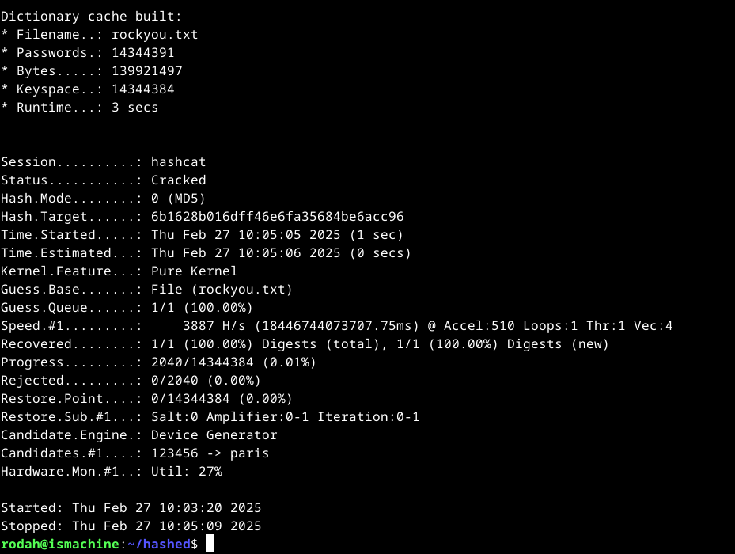
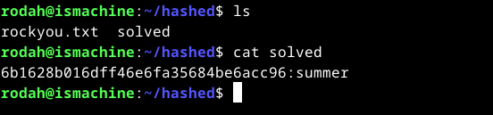
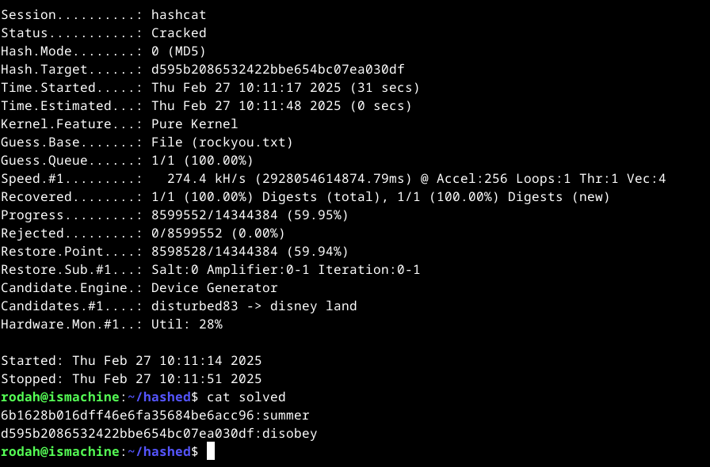

# H6 Homework

## X) Summaries

### <ins>Applied Cryptography: Chapter 2.3 - One-Way Functions</ins>   

<ins>Definition of one-way functions</ins>  
- A one-way function is a function which is easy to compute but difficult to reverse.
  - Given x, computing f(x) is easy. However, given f(x), computing x is difficult even with unlimited time and computing power.  

<ins>One-way functions & cryptography</ins>  
- One-way functions by themselves are not useful for encryption as they cannot be decrypted. 
- A trapdoor one-way function is a special type of one-way function which is hard to compute in reverse unless a secret piece of information, a “trapdoor”, is known. Thus, a trapdoor one-way function enables both encryption and decryption.
  - Given f(x) and y, it will be easy to compute x.
    
- The concept of trapdoor one-way functions are at the foundation of public-key cryptography.
    

### <ins>Applied Cryptography: Chapter 2.4 - One-Way Hash Functions</ins>   

<ins>Definition of hash functions</ins>
- Hash functions take variable-length input strings (pre-image) and convert them to fixed-length output strings (hash value).
- The hash value “fingerprints” the pre-image. Since several inputs can produce the same hash, the fingerprints are not entirely unique. However, they provide a “good-enough” assurance of accuracy for practical purposes.

<ins>Definition of one-way hash functions</ins>
- A one-way hash function works in one direction, where it is easy to compute a hash value from a pre-image but hard to reverse the process.
- Aka:
  - Compression function, Contraction function, Message digest, Fingerprint, Cryptographic checksum, Message integrity check (MIC), and Manipulation detection code (MDC).

<ins>Characteristics of one-way hash functions</ins>
- One-wayness: It’s easy to compute the hash, but unfeasible to reverse the process. The output is not dependent on the input in any observable way.
- Publicity: The function’s security relies on its one-wayness and not the process itself. Information about the hash function is publicly disclosed.
- Avalanche effect: A slight change in input results in a significant change in the output (hash value).
- Collision-free: It is difficult to find different inputs/pre-images that result in same hash output. Good one-way hash functions are collision-free. 

<ins>One-way hash functions & keys</ins>
- Using keyless one-way hash functions allow anyone to compare and verify the hashes.
- Message or data authentication codes (MACs/DACs) are an enhanced version of the one-way hash function which include a secret key. The hash value is the function of both the pre-image and the key. Only someone with the correct key can verify the hash value.

<ins>One-way hash functions & cryptography</ins>  
- One-way hash functions are the foundation of modern public-key cryptography.

### <ins>References:</ins>  
- Schneier, B. 2015: Applied Cryptography: Chapter 2: Protocol Building Blocks. O’Reilly Online Learning. Available at: https://learning.oreilly.com/library/view/applied-cryptography-protocols/9781119096726/10_chap02.html#chap02-sec001 

## A) Install Hashcat. Test it with a sample hash.

1. Install the apps & create a separate directory for the task:
- `sudo apt-get update`
- `sudo apt-get -y install hashid hashcat wget`
- `mkdir hashed`
- `cd hashed`
  
2. Download a (large) dictionary from the web:
- `wget https://github.com/danielmiessler/SecLists/raw/master/Passwords/Leaked-Databases/rockyou.txt.tar.gz`
  
3. Uncompress and extract the contents. Delete the compressed file.
- `tar -xf rockyou.txt.tar.gz`
- `rm rockyou.txt.tar.gz`
-  To check the dictionary contents: `wc -l rockyou.txt`,  `head rockyou.txt, `less rockyou.txt `
  

### <ins>Crack with a sample hash: 6b1628b016dff46e6fa35684be6acc96</ins>   
1. Identify the hash type (required by hashcat):
- `hashid -m 6b1628b016dff46e6fa35684be6acc96`
- The command:
  - `hashid` tool used to identify the type of a specified hash
  - `-m` Includes  the corresponding hashcat mode in output. Used to help identify the correct mode to use with hashcat.
  - `6b1628b016dff46e6fa35684be6acc96`the hash to be cracked

- Since MD5 (mode 0) is the most common hash, it’s selected for the next steps.
  

2. Crack the hash
- `hashcat -m 0 '6b1628b016dff46e6fa35684be6acc96' rockyou.txt -o solved`
- The command:
  - `hashcat` the program used for cracking the hash
  - `-m 0` type of the hash, retrieved with either 'hashid' or 'hashcat --example-hashes'
  - `6b1628b016dff46e6fa35684be6acc96`the hash to be cracked
  - `rockyou.txt ` The wordlist used for the attack
  - `-o solved` saves the solution as a new plain text file "solved" inside the working directory.
    
- Output:

  - Status field: “Cracked” indicates that hashcat found a matching password in the dictionary and the cracked password was saved in the “solved” -file.  “Exhausted” indicate that failed to find a matching password in the dictionary.
    
3. Check the solution:
- `cat solved`
- (Alternative: If no output file was specified, the results can be directly displayed with `hashcat -m 0 6b1628b016dff46e6fa35684be6acc96 rockyou.txt --show` )

<ins>References</ins>
- Karvinen 2023: PGP - Cracking Passwords with Hashcat at https://terokarvinen.com/2022/cracking-passwords-with-hashcat/ 

## B) Crack the hash: d595b2086532422bbe654bc07ea030df

- Refer to the steps in task a)
- `hashid -m d595b2086532422bbe654bc07ea030df`
- `hashcat -m 0 'd595b2086532422bbe654bc07ea030df' rockyou.txt -o solved`
- `cat solved`

