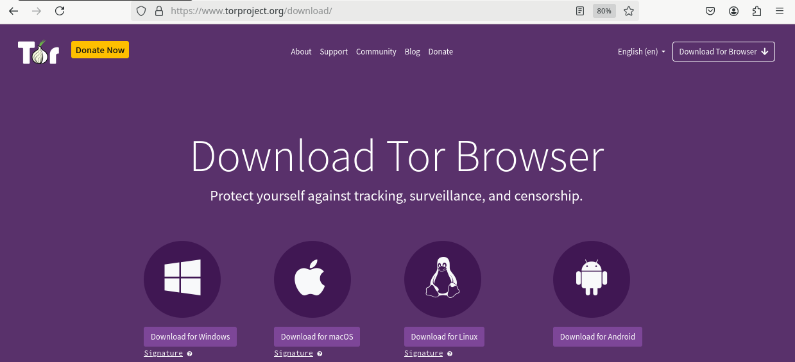
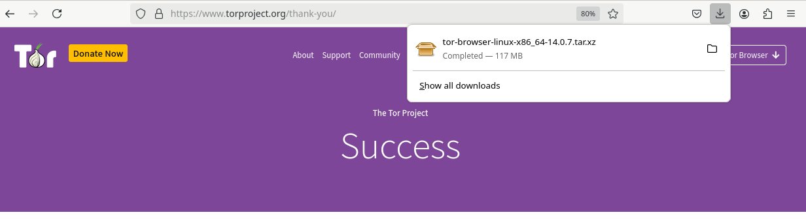
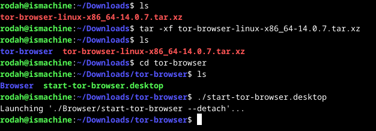
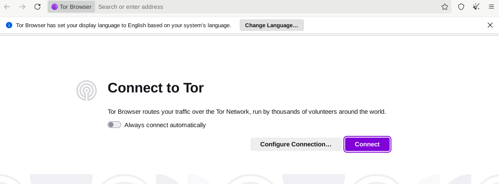
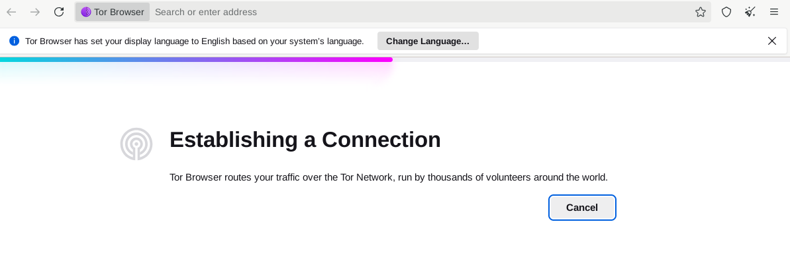
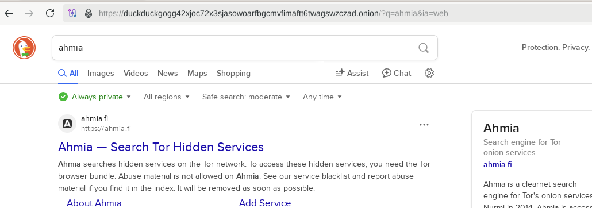

# H7 Homework

## X) Summaries

### <ins>1.) 7 Things You Should Know About Tor</ins>  

- Tor is open-source and used for anonymity, privacy and secure communication by criminals and non-criminals alike. It is e.g. some of the strongest existing anonymity software, but it isn’t particularly more useful for illegal activities compared to other tools available.
- Tor still seems to be secure at the cryptographic level. Attacks on Tor usually exploit browser vulnerabilities/bugs and user misconfigurations. 
- Tor is not foolproof. Users can compromise their anonymity through improper use, such as logging into personal accounts over Tor or forgetting to update the software. 
- One of the easiest ways to get started with Tor is through downloading the browser bundle, which provides a browser with a pre-configured Tor. 
- Tor is slower than regular internet, but it’s performance/speed has improved due to ongoing improvements. One way to speed up the Tor network is to create more relays. 
- Running a Tor relay should be legal in the USA at least.
- It’s been confirmed that the Tor software doesn’t include a backdoor.

### <ins>2.) Hiding Behind the Keyboard: The Tor Browser</ins>  

<ins>Introduction</ins>   
- Tor browser is a modification of the Firefox browser, used for anonymous communication over the internet.
- Tor enables anonymous communication over the internet by hiding users’ originating IP addresses. Attempts to trace or identify the anonymized users is highly difficult without employing advanced methods- 
- Besides Tor, other means of anonymous internet use exist. 

<ins>History and Intended Use of The Onion Router</ins>  
- Tor was originally developed by the U.S. government (2002) but is now maintained as an  open-source project. 
- Tor's primary goal is to enable anonymous, private and unrestricted communication. It’s also used to e.g. bypass censorship and allow whistleblowing. 
- Tor is highly secure and resistant to tracking, which makes investigative efforts challenging. 
- The book outlines two investigative approaches to be used with Tor:
  1. Device forensics which examine devices for traces of Tor installation and use. 
  2. Real-time tracking and interception of ongoing communications over Tor.    

<ins>How The Onion Router Works</ins>
- Tor wraps data in multiple layers of encryption (like an onion) and routes it through random relays before reaching the final destination. Each relay removes one encryption layer and forwards the data to the next relay. Each relay only knows the previous and next hop and never the full path.
- Tor uses elliptic curve cryptography to encrypt the data, which is currently unbreakable with brute force. 
- The last relay, called the exit relay, is the only part that connects to the internet and the destination. Destinations only see the exit relay’s IP address, not the originating source’s. The connection between Tor relays is always encrypted,. The final link may be unencrypted.
- Tor changes the relays every 10 minutes, making tracking difficult.
- Since exit nodes forward traffic for others, the operator is not necessarily responsible for the content passing through.  

<ins>Tracking Criminals Using TOR</ins>  
- Governments have made attempts to deanonymize Tor users, but most successes come from user mistakes rather than breaking Tor itself.
- User errors include customizations to the Tor browser, enabling scripts or plugins or allowing geolocation which risk exposing the user’s IP address/identity.
- Deanonymization attempts include disabling portions of the Tor network, controlling entry and exit nodes and conducting man-in-the-middle attacks. However, these approaches require significant resources unavailable to most. Other methods for exposing the target IP address placing a tracking script inside emails/documents sent to the target or open-source intelligence (OSINT) efforts to link the target’s real life identity with their dark web identity.

### <ins>References</ins>   
- Quintin 2014:  7 Things You Should Know About Tor at https://www.eff.org/deeplinks/2014/07/7-things-you-should-know-about-tor 
- Shavers & Bair 2016: Hiding Behind the Keyboard: The Tor Browser at https://learning.oreilly.com/library/view/hiding-behind-the/9780128033524/

## A) Install TOR browser and access TOR network (.onion addresses)  

- Go to `https://www.torproject.org/download/`to download the browser. The browser will be downloaded in the `Downloads` directory.

- In the terminal, go to said directory and uncompress the file with `tar -xf tor-browser-linux-x86_64-14.0.7.tar.xz`
- Goto the tor-browser directory `cd tor-browser`
- To start the browser, run it as script `./start-tor-browser.desktop`

- Connect to Tor with `Connect`

<ins>References</ins>
- Karvinen 2025 - Information security at https://terokarvinen.com/information-security/

## B) Browse TOR network, find, take screenshots and comment
<ins>Search engine for onion sites</ins>
- DuckDuckGo seems to be the default search engine. Another well-known option is e.g. Ahmia.

<ins>Marketplace</ins>
- Seems like a fair share of well-known marketplaces have been taken down. One currently running one is Archetyp Market. Archetyp seems to only accept drug-related listings and all transactions are conducted using a private cryptocurrency (Monero). 
- The marketplace requires user sign-up/login, which I will not be doing for this task.

<ins>Forum</ins>
- Dread is a Reddit-like dark web discussion forum. Both operate on the TOR network.

<ins>A site for a well-known organization which has a physical street address in the real world</ins>
- The BBC News and The Guardian provide an onion service to allow readers access to news content securely and anonymously, especially in areas with censorship.

<ins>References</ins>
- Wikipedia. (2024). List of Tor onion services. Available at: https://en.wikipedia.org/wiki/List_of_Tor_onion_services.
- Wikipedia. (2025). Archetyp Market. Available at: https://en.wikipedia.org/wiki/Archetyp_Market
